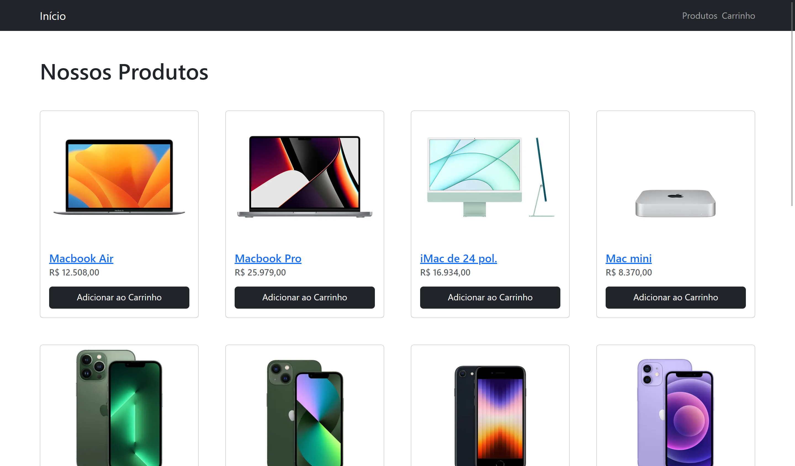

# Projeto Ecommerce Next



## 💭 Descrição

Este projeto representa um site de comércio eletrônico (E-Commerce) desenvolvido como parte do treinamento oferecido pelo curso da OneBitCode. O foco principal deste projeto é proporcionar uma oportunidade de aprimorar o conhecimento e habilidades na utilização do framework Next.js, uma tecnologia amplamente adotada no desenvolvimento web moderno.

## 🧠 Funcionalidades

✔️ **Listagem de Produtos:** Exibe uma lista de produtos disponíveis para compra, incluindo imagens, nomes, preços.

✔️ **Detalhes do Produto:** Permite aos usuários visualizar informações detalhadas sobre um produto específico, incluindo imagem, nome, preço, descrição e quantidade em estoque.

✔️ **Carrinho de Compras:** Permite que os usuários adicionem produtos ao carrinho de compras, visualizem os itens selecionados e ajustem as quantidades.

✔️ **Layout Responsivo:** A página é otimizada para ser visualizada em diferentes dispositivos e tamanhos de tela, garantindo uma experiência de usuário consistente.

## 🖥️ Tecnologias Utilizadas

- [React](https://react.dev) - biblioteca para interfaces de usuário
- [Next](https://nextjs.org/) - framework react para aplicações web
- [Typescript](https://www.typescriptlang.org) - superset, linguagem baseada em javascript
- [Bootstrap](https://getbootstrap.com) - framework CSS

## 🛠️ Modificando o projeto

### Siga as seguintes instruções para instalar e poder modificar o projeto em sua máquina:

### 📋 Pré-requisitos:

Para baixar, executar e modificar o projeto, você precisa ter instalado em sua máquina:

- [Node](https://nodejs.org/en)
- Um gerenciador de pacotes, como o [PNPM](https://pnpm.io), [Npm](https://nodejs.org/en/) ou [Yarn](https://classic.yarnpkg.com/lang/en/docs/install)
- [Git](https://git-scm.com/downloads)
- Editor de código ou IDE, como o [VSCode](https://code.visualstudio.com/Download)

### 🔧 Instalação e execução

1. Clone o repositório

```bash
git clone https://github.com/aleretamero/ecommerce-next.git
```

2. Acesse a pasta do projeto

```bash
cd ecommerce-next
```

3. Instale as dependências

```bash
npm install
# ou
pnpm install
# ou
yarn install
```

4. Inicie o servidor de desenvolvimento do projeto

```bash
npm run dev
# ou
pnpm dev
# ou
yarn dev
```

5. Crie um arquivo `.env` na raiz do projeto e nele você coloca `API_URL="URL"` altere a `"URL"` pela URL que seu servidor está rodando.

Obs: o servidor iniciará na porta 3000 - acesse por: <http://localhost:3000/>

## Colaboradores 🤝🤝

| Foto                                                       | Nome                                                 |
| ---------------------------------------------------------- | ---------------------------------------------------- |
|  | [Alexandre Retamero](https://github.com/aleretamero) |

## Licença

[MIT](https://choosealicense.com/licenses/mit/)
